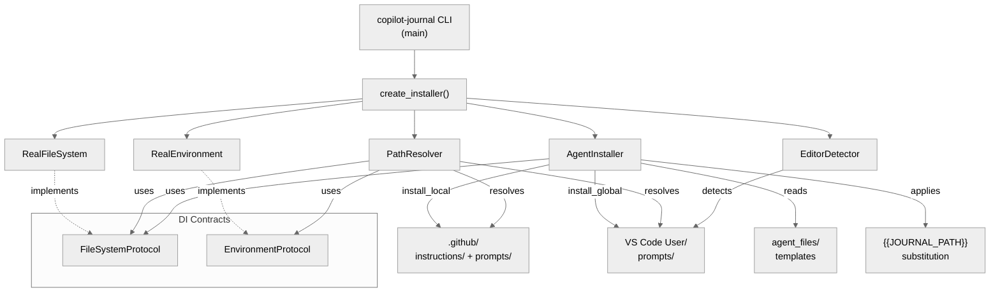
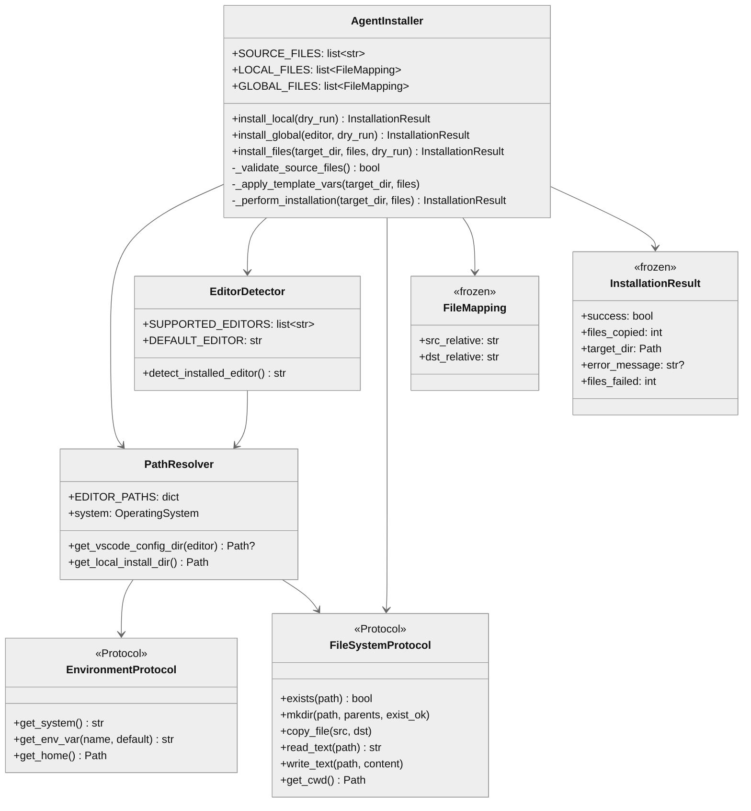

# copilot_journal — Architecture

## 1. Component Overview

| Field | Value |
|-------|-------|
| **Name** | `copilot_journal` |
| **Type** | package (CLI + agent file bundle) |
| **Responsibility** | Install GitHub Copilot journaling instructions/prompts to local repos or global VS Code config |
| **Boundaries** | Reads bundled `agent_files/`, writes to `.github/` (local) or VS Code User dir (global) |
| **Public surface** | `create_installer()`, `setup_logging()`, `main()`, `AgentInstaller`, `InstallationResult` |
| **Patterns** | Dependency injection via Protocols, Factory pattern (`create_installer`), Strategy (local vs global install) |
| **Language** | Python ≥3.13 |
| **Runtime** | CPython, no dependencies |
| **Entry points** | CLI: `copilot-journal` → `install:main`. Programmatic: `create_installer()` |
| **State** | Stateless — reads source files, writes to target, no persistence |
| **Key decisions** | Protocol-based DI for testability without mocks; agent files bundled as package data; template vars (`{{JOURNAL_PATH}}`) for per-project customization |
| **Risks** | Agent file content drift between `agent_files/` and `.github/` copies; cross-platform path resolution edge cases |

## 2. Code Layout

```
src/copilot_journal/
├── __init__.py                  # Package docstring, re-exports nothing
├── __version__.py               # Single source of truth: __version__ = "0.3.1"
├── install.py                   # CLI + installer logic (all business code)
└── agent_files/                 # Bundled templates copied during install
    ├── instructions/
    │   └── journaling.instructions.md   # Always-on Copilot journaling behavior
    └── prompts/
        ├── daily-summary.prompt.md      # End-of-day journal summary generator
        └── setup-dendron-vault.prompt.md # Dendron vault initialization guide
```

## 3. Public Surface

### 🔒 Frozen APIs

| Symbol | Signature | Stability | Change Impact |
|--------|-----------|-----------|---------------|
| `main` | `() -> int` | 🔒 frozen | CLI entry point; breaking = all users |
| `create_installer` | `(agent_files_dir?, logger?, journal_path?) -> AgentInstaller` | 🔒 frozen | Factory; programmatic users depend on it |
| `setup_logging` | `(level?, log_file?, logger_name?) -> Logger` | 🔒 frozen | Used by CLI and tests |
| `AgentInstaller.install_local` | `(dry_run?) -> InstallationResult` | 🔒 frozen | Primary install method |
| `AgentInstaller.install_global` | `(editor?, dry_run?) -> InstallationResult` | 🔒 frozen | Global install method |
| `InstallationResult` | `dataclass(success, files_copied, target_dir, error_message?, files_failed?)` | 🔒 frozen | Return contract for all install ops |
| `FileMapping` | `dataclass(src_relative, dst_relative)` | 🔒 frozen | Used in SOURCE_FILES/LOCAL_FILES/GLOBAL_FILES |

### ⚠️ Internal

| Symbol | Role |
|--------|------|
| `AgentInstaller._validate_source_files` | Guard: agent_files_dir exists |
| `AgentInstaller._apply_template_vars` | `{{JOURNAL_PATH}}` substitution |
| `AgentInstaller._perform_installation` | File copy loop + template apply |
| `AgentInstaller.install_files` | Shared orchestrator (validate → dry-run or perform) |
| `PathResolver` | OS-specific path resolution |
| `EditorDetector` | Auto-detect Code vs Code-Insiders |
| `RealFileSystem` / `RealEnvironment` | Production thin delegates (pragmatically no-cover) |
| `FileSystemProtocol` / `EnvironmentProtocol` | DI contracts for testability |
| `OperatingSystem` | Enum: WINDOWS, DARWIN, LINUX |

### Data Contracts

**Inputs:**
- `agent_files/` directory (bundled templates with `{{JOURNAL_PATH}}` placeholders)
- CLI args: `--global`, `--local`, `--insiders`, `--dry-run`, `-j <path>`, `--log-level`, `--log-file`
- Interactive: TTY prompt for journal path when no `-j` provided

**Outputs:**
- Copied files to `.github/{instructions,prompts}/` (local) or VS Code `User/prompts/` (global)
- `{{JOURNAL_PATH}}` replaced with user-specified path in installed copies
- `InstallationResult` with success/failure metadata
- Exit code: 0 success, 1 failure

## 4. Dependencies

| Direction | Target | Interface |
|-----------|--------|-----------|
| **depends_on** | Python stdlib: `argparse`, `logging`, `shutil`, `pathlib`, `platform`, `os`, `sys`, `dataclasses`, `enum`, `typing` | import |
| **depends_on** | `agent_files/` (bundled package data) | fs read |
| **required_by** | `pyproject.toml` `[project.scripts]` → `copilot-journal` CLI | entry point |
| **required_by** | `tests/test_install.py` (2982 lines, 57 tests) | import |
| **IO** | fs: read source templates, write to `.github/` or VS Code User dir | `FileSystemProtocol` |
| **IO** | env: `platform.system()`, `os.environ` (APPDATA on Windows), `Path.home()` | `EnvironmentProtocol` |

**Zero runtime dependencies.** Dev deps: ruff, bandit, pytest, pytest-cov, mypy, pre-commit.

## 5. Invariants & Errors

### Invariants (⚠️ MUST PRESERVE)

| Invariant | Threshold |
|-----------|-----------|
| `InstallationResult.success=True` iff `files_copied > 0` | always |
| Template var `{{JOURNAL_PATH}}` fully resolved in all installed files | always |
| `FileMapping` and `InstallationResult` are frozen (immutable) | always |
| CLI exit code matches `InstallationResult.success` (0=True, 1=False) | always |
| `--global` and `--local` are mutually exclusive | always |
| Agent source files list: exactly 3 files in `SOURCE_FILES` | until new agent files added |

### Verification

```bash
pdm run test          # pytest tests/ -v
pdm run test-cov      # with branch coverage (fail_under=80)
pdm run lint          # ruff check
pdm run typecheck     # mypy --strict
pdm run security      # bandit
pdm run check-all     # all of the above
```

### Errors

| Error | When | Handling |
|-------|------|----------|
| `ValueError("Unsupported operating system")` | `PathResolver.__init__` on unknown OS | Propagates to caller |
| `ValueError("Invalid log level")` | `setup_logging` with bad level string | Propagates to caller |
| `OSError` during mkdir/copy | `_perform_installation` | Caught → `InstallationResult(success=False)` |
| `OSError` during template read/write | `_apply_template_vars` | Silently ignored (non-critical) |
| Agent files dir missing | `_validate_source_files` | Returns False → `InstallationResult(success=False)` |
| Config dir not found (global) | `install_global` | Returns failure with tip message |

### Side Effects

- **Disk write:** Copies 3 files to target directory, creates parent dirs
- **Disk write:** Overwrites `{{JOURNAL_PATH}}` in installed copies
- **Stdout:** Logging output (emoji-prefixed progress messages)
- **Optional disk write:** Log file if `--log-file` specified

## 6. Usage

### CLI

```bash
# Local install (default)
copilot-journal -j docs/journal

# Global install
copilot-journal --global --insiders -j docs/journal

# Preview
copilot-journal --dry-run
```

### Programmatic

```python
from copilot_journal.install import create_installer

installer = create_installer(journal_path="docs/journal")
result = installer.install_local()
assert result.success
```

### Config

| Source | Key | Default |
|--------|-----|---------|
| CLI arg | `-j` / `--journal-path` | `docs/journal` |
| CLI arg | `--log-level` | `INFO` |
| CLI arg | `--log-file` | None (stdout only) |
| Interactive | TTY prompt | `docs/journal` |
| Template var | `{{JOURNAL_PATH}}` | Replaced at install time |

### Pitfalls

| Issue | Fix |
|-------|-----|
| Files not discovered by Copilot | Ensure `.github/` is at git repo root, not a subdirectory |
| Wrong editor targeted | Use `--insiders` flag or verify with `--dry-run` |
| Template vars not replaced | Check `_apply_template_vars` — OSError is silently ignored |
| Tests import errors | Run from repo root: `pdm run test` |

## 7. AI-Accessibility Map

| Task | Target | Guards | Change Impact |
|------|--------|--------|---------------|
| Add new agent file | `agent_files/` + `SOURCE_FILES` list | Update `SOURCE_FILES`, `LOCAL_FILES`, `GLOBAL_FILES` in `install.py` | New file not installed if list not updated |
| Change template variable | `_apply_template_vars` | Must update all agent files containing the var | Installed files will have unresolved placeholders |
| Add OS support | `OperatingSystem` enum + `EDITOR_PATHS` dict | Add enum member + path mapping | `PathResolver.__init__` raises on unknown OS |
| Modify CLI args | `main()` argparse block | Update tests in `TestMain` (13 tests) | Exit code contract, arg parsing |
| Change install target structure | `LOCAL_FILES` / `GLOBAL_FILES` mappings | Update file mappings + test assertions | Files land in wrong dirs |
| Bump version | `__version__.py` | Update test assertion in `TestModuleImports.test_version` | Version mismatch in `--version` output |
| Modify logging format | `setup_logging()` | `_LOG_DATE_FORMAT` constant | Affects CLI output and log files |
| Change DI contracts | `FileSystemProtocol` / `EnvironmentProtocol` | Must update `RealFileSystem`/`RealEnvironment` + `FakeFileSystem`/`FakeEnvironment` in tests | Breaks all installer tests |

## 8. Mermaid




